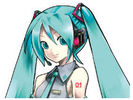
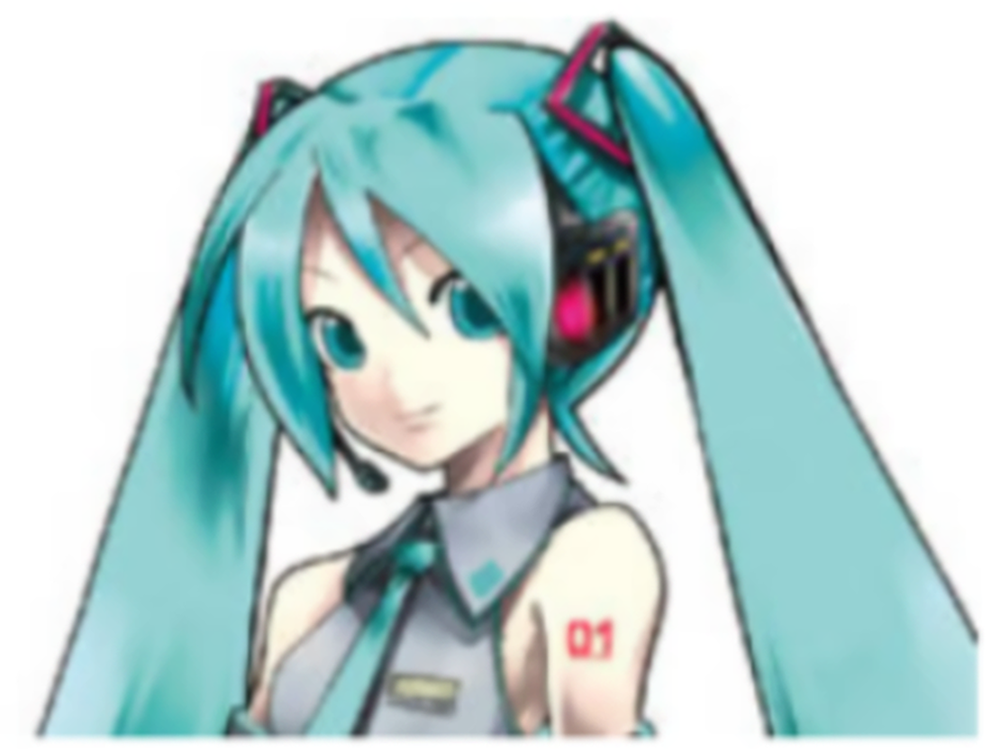

# reflex-resize
reflex image resize algolithm

## what is reflex-resize
It is a improve of
[画質をできるだけ落とさずに「写真を拡大する」方法](https://www.lifehacker.jp/2017/02/170204_20170204_picture_size.html)
[How to Digitally Increase the Size of a Picture Without Ruining Picture Quality](https://www.makeuseof.com/tag/how-to-digitally-increase-the-size-of-a-picture-without-ruining-picture-quality/)

in auto bash script.
Requires imagemagick.
scale factor = 5.01x

$ bash reflex-resize-1.sh input.jpeg output.png

### What is improved
Double resample algolithm
First, spline resampler for smooth and noise blur.
It can eliminate JPEG particle noise.
Second, Sinc resampler for shaping.
Sinc resampler is good for deblur.
